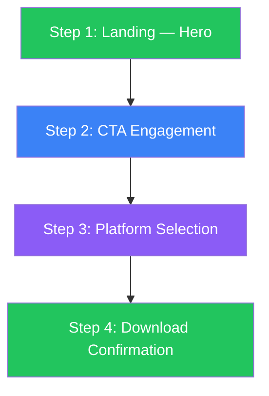

# Perfected Flow — Seed Phrase Onboarding Entry Point

**The Mukamal Way — Web3 Wallet Homepage → Download Initiation**

---

## Flow Overview



---

## Step 1: Landing — Hero

**Objective:** Communicate product value in <3 seconds. Zero friction.

### Desktop (1440×900)

| Property | Specification |
|----------|--------------|
| Layout | 2-column grid: `grid-template-columns: 1fr 1fr` |
| Gap | `48px` |
| Nav Height | `72px` |
| Hero Padding | `64px 80px` |
| Min Height | `calc(100vh - 72px)` |

**Left Column (Text):**
| Element | Spec |
|---------|------|
| Headline | `font-size: 64px; line-height: 1.1; font-weight: 700; letter-spacing: -0.02em` |
| Subtitle | `font-size: 18px; line-height: 1.5; font-weight: 400; opacity: 0.7; margin-top: 16px` |
| CTA | `height: 56px; padding: 0 48px; border-radius: 28px; font-size: 18px; font-weight: 600; margin-top: 32px` |

**Right Column (Visual):**
| Element | Spec |
|---------|------|
| Product Mockup | `max-width: 400px; height: auto; border-radius: 24px; box-shadow: 0 16px 48px rgba(0,0,0,0.16)` |
| Content | Wallet UI showing portfolio balance, token list, action buttons (Buy/Swap/Send) |

### Mobile (375×812)

| Property | Specification |
|----------|--------------|
| Layout | Single column flex: `flex-direction: column; align-items: center` |
| Padding | `24px 16px 0` |
| Nav Height | `64px` |

| Element | Spec |
|---------|------|
| Headline | `font-size: 40px; line-height: 1.1; font-weight: 700; text-align: center` |
| Subtitle | `font-size: 16px; line-height: 1.5; opacity: 0.7; max-width: 280px; margin: 16px auto; text-align: center` |
| CTA | `width: 100%; max-width: 327px; height: 56px; border-radius: 28px; font-size: 18px; margin-top: 24px` |
| Product Mockup | `width: 240px; margin-top: 32px` (optional — can omit on mobile if space is tight) |

### Required Elements (Non-Negotiable)

- ✅ Headline with clear product value proposition
- ✅ Subtitle explaining what the product does
- ✅ Primary CTA (≥56px height)
- ✅ Product visual (mockup, screenshot, or portfolio preview)
- ✅ Complete navigation with Support link
- ❌ No cookie banners blocking content
- ❌ No autoplay media
- ❌ No chat widgets with badges
- ❌ No CAPTCHA walls

### Cognitive Load Budget

| Metric | Target | Reasoning |
|--------|--------|-----------|
| Visual focal points | ≤2 | Miller's Law: reduce chunks to minimize cognitive load |
| Time to value prop | <3s | First-time visitor must understand product in 3 seconds |
| Above-fold content density | ≥75% | Minimize dead whitespace above first interaction point |
| Text blocks | ≤3 | Headline + subtitle + CTA label = 3 text elements max |

---

## Step 2: CTA Engagement

**Objective:** Provide clear visual feedback confirming interactivity.

### Hover State (Desktop)

```css
.cta-primary:hover {
  transform: scale(1.02);
  box-shadow: 0 8px 24px rgba(0, 0, 0, 0.15);
  transition: all 200ms ease;
}
```

### Active State (Both)

```css
.cta-primary:active {
  transform: scale(0.98);
  transition: all 100ms ease;
}
```

### Focus State (Accessibility)

```css
.cta-primary:focus-visible {
  outline: 3px solid currentColor;
  outline-offset: 4px;
  border-radius: 28px;
}
```

### CTA Pattern

| Component | Spec |
|-----------|------|
| Icon | `width: 20px; height: 20px; margin-right: 12px` — download icon or platform icon |
| Label | `font-size: 18px; font-weight: 600` — "Download [Product Name]" |
| Container | `display: inline-flex; align-items: center; justify-content: center; gap: 12px` |

---

## Step 3: Platform Selection

**Objective:** Let user choose their platform without leaving the page.

### Implementation Options

**Option A: Inline Expansion (Preferred)**

The CTA expands to reveal platform options below it.

```css
.platform-selector {
  max-width: 480px;
  margin: 24px auto 0;
  padding: 32px;
  background: var(--surface-muted);
  border-radius: 24px;
  display: grid;
  grid-template-columns: repeat(auto-fit, minmax(120px, 1fr));
  gap: 16px;
}
```

**Option B: Modal Overlay**

```css
.modal-backdrop {
  background: rgba(0, 0, 0, 0.5);
  backdrop-filter: blur(8px);
}

.modal-content {
  max-width: 480px;
  padding: 48px;
  border-radius: 24px;
  background: var(--surface-light);
}
```

### Platform Options

| Platform | Icon | Label | Action |
|----------|------|-------|--------|
| iOS | Apple icon (24px) | "App Store" | Redirect to App Store listing |
| Android | Play icon (24px) | "Google Play" | Redirect to Play Store listing |
| Chrome | Chrome icon (24px) | "Chrome Extension" | Redirect to Chrome Web Store |
| Firefox | Firefox icon (24px) | "Firefox Add-on" | Redirect to Firefox Add-ons |
| QR Code | QR symbol (24px) | "Scan to Download" | Show QR code for mobile download |

### Secondary Action

```
Already have a wallet? → Import existing wallet
```

`font-size: 14px; color: var(--text-muted); text-decoration: underline; margin-top: 24px`

---

## Step 4: Download Confirmation

**Objective:** Confirm action success and guide user to next step.

### Success State

| Element | Spec |
|---------|------|
| Checkmark Animation | Lottie animation, `width: 64px; height: 64px; duration: 2s` |
| Confirmation Text | `font-size: 20px; font-weight: 600; margin-top: 16px` — "Opening [Store Name]..." |
| Help Link | `font-size: 14px; color: var(--text-muted); margin-top: 24px` — "Need help? Visit our support center" |
| Auto-redirect | `setTimeout(() => window.open(storeUrl), 1500)` |

### Fallback State

If redirect doesn't trigger (popup blocked):

| Element | Spec |
|---------|------|
| Manual Link | `font-size: 16px; font-weight: 500; color: var(--accent); text-decoration: underline` — "Click here to download manually" |
| Retry CTA | `height: 48px; padding: 0 32px; border-radius: 24px` — "Try Again" |

---

## Validation Checklist

| # | Check | Pass Criteria |
|---|-------|---------------|
| 1 | Hero loads in <3s with no interruptions | No cookie banner, no CAPTCHA, no autoplay |
| 2 | Value proposition readable in <3s | Headline + subtitle communicate product function |
| 3 | CTA visible above fold | CTA center-point is within viewport on load |
| 4 | CTA meets Fitts's Law | Height ≥56px, width ≥160px (desktop) or 100% (mobile) |
| 5 | All text meets WCAG AAA contrast | Normal text ≥7:1, large text ≥4.5:1 |
| 6 | Support accessible from nav | "Support" or "Help" link in primary navigation |
| 7 | Platform selection is frictionless | ≤1 click from CTA to platform choice |
| 8 | Confirmation provides clear feedback | Visual + text confirmation of successful action |
| 9 | Mobile content density ≥75% | No excessive whitespace above key content |
| 10 | Total visual focal points ≤2 | Hero section has max 2 competing visual elements |
