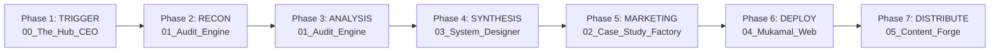

# Mukamal OS Architecture

## 1. System Model: Two-Layer Skill Architecture

Mukamal OS operates on a **two-layer model** that separates domain execution from skill lifecycle management:

| Layer | Location | Function |
|-------|----------|----------|
| **Global Skills** (Meta) | `~/Documents/Global Skills/` | Create, update, test, version, archive, and route skills |
| **Mukamal Skills** (Domain) | `Mukamal/skills/` | Execute the actual pipeline work — auditing, designing, publishing, distributing |

The Global Skills manage the *lifecycle* of Mukamal Skills. Mukamal Skills do the *work*.

### Global Skills Inventory (8 Meta-Skills)

| Skill | Function |
|-------|----------|
| **Skill Creator** | Intent → new skill + registry manifests |
| **Skill Updater** | Existing skill → updated version |
| **Skill Search & Retrieve** | Problem → best match (≥80%) or Creator route |
| **Skill Execute/Test** | Sandbox: raw output only |
| **Skill Analytics** | Grades outputs → Deploy / Update / Deprecate |
| **Skill Backup** | Skill → JSON payload with semver |
| **Skill Archive & Delete** | Dependency-safe deprecation + purge |
| **Skill Acquisition Planner** | Macro goal → micro-skill roadmap |

---

## 2. The Mukamal Pillars (Central Intelligence Core)

The workspace is orchestrated via a Central Intelligence Core where the Mukamal AI-CEO delegates to specialized Sub-Agents.

### The Orchestrator
- **`00_The_Hub_CEO` (The Strategist)**
  - Receives high-level mandates (e.g., "Yield 5 FinTech Leads")
  - Translates constraints down the chain
  - Consumes "Lessons Learned" from completed projects to improve subsequent loops

### The Execution Ring (Specialized Sub-Agents)
### The Execution Ring (Specialized Sub-Agents)
- **`01_Audit_Engine` (The Analysis Core)** — Heuristic and visual competitor analysis. (Stateless processing node).
- **`02_Case_Study_Factory` (The Sales Engine)** — Dual-mode: Public Audits (lead magnets) + Private Audits (client delivery).
- **`03_System_Designer` (The Creative Director AI)** — Structural layouts, design tokens, "Before & After" visualizations.
- **`04_Mukamal_Web` (The Showroom)** — Elite agency website build + gated report hosting.
- **`05_Content_Forge` (The Distribution Grid)** — Outbound email/LinkedIn blasts from formatted case studies.
- **`06_Workspace` (The Storage Drive)** — Dedicated storage for all client, brand, and project data (e.g., `web3-wallets` reports and tokens).

---

## 3. Domain Skills Ledger

Each domain skill maps to its primary pillar and follows the Global Skill SKILL.md format:

| Skill | Pillar | Execution Role |
|-------|--------|----------------|
| **`visual-capture-engine`** | `01_Audit_Engine` | Headless/interactive viewport capture, geometry locking, UI sanitization |
| **`auditing-ux`** | `01_Audit_Engine` | Heuristic scoring (Nielsen, WCAG, Cognitive Load) against captured interfaces |
| **`competitor-visual-audit`** | `01_Audit_Engine` | Top N competitor capture → competitive matrices |
| **`harvesting-brand-tokens`** | `01_Audit_Engine` / `03_System_Designer` | DOM token extraction, AAA contrast enforcement |
| **`designing-systems`** | `03_System_Designer` | Broken metrics → Figma-ready tokens, 8px grid layouts, perfected flows |

---

## 4. The 7-Phase Pipeline



**Web3 Seed Phrase Example:**
1. **Trigger**: Hub detects Web3 seed phrase friction trend.
2. **Reconnaissance**: `competitor-visual-audit` captures Top 5 wallets at locked geometry.
3. **Data Analysis**: `auditing-ux` scores captures — 80% fail at the "Phrase" tier.
4. **Visual Synthesis**: `designing-systems` computes "Perfected Seed Phrase Flow" (The Mukamal Way).
5. **Marketing Translation**: Case Study Factory aggregates into "Web3 UX Report 2026."
6. **Deployment**: Mukamal Web publishes to `mukamal.com/web3-report`.
7. **Distribution**: Content Forge triggers outbound APIs to email high-value leads.

---

## 5. Directory Structure

```
Mukamal/
├── .agents/
│   ├── rules.md                         # Project rules (Brand DNA)
│   └── workflows/
│       └── pipeline.md                  # 7-phase pipeline workflow
├── 00_The_Hub_CEO/                      # CEO brain + orchestration
├── 01_Audit_Engine/                     # Analysis Core (Stateless)
├── 02_Case_Study_Factory/               # Case Study Generator (Stateless)
├── 03_System_Designer/                  # Design logic/rules (Stateless)
├── 04_Mukamal_Web/                      # Web deployments
├── 05_Content_Forge/                    # Outbound configs
├── 06_Workspace/                        # ALL client data & reports
│   └── web3-wallets/
│       ├── 01_Audit_Data/
│       ├── 02_Case_Studies/
│       └── 03_Design_Systems/
├── docs/                                # Documentation 
│   ├── Architecture.md
│   ├── Businessplan.md
│   └── Documentation.md
└── skills/                              # Executable AI tools
    ├── visual-capture-engine/SKILL.md
    ├── auditing-ux/SKILL.md
    ├── competitor-visual-audit/SKILL.md
    ├── harvesting-brand-tokens/SKILL.md
    └── designing-systems/SKILL.md
```

---

## 6. Strategic Roadmap

- **Phase A (Heuristic Intelligence Engine)**: Ingestion pipeline for Human Input + Notebook LM to continuously update heuristic frameworks.
- **Phase B (Distribution Logic)**: Dedicated `content-forging` skill for `05_Content_Forge`.
- **Phase C (CEO Memory Bank)**: Lessons Learned loop for `00_The_Hub_CEO`.
- **Phase D (Journey Mode)**: Multi-step interaction capture in `visual-capture-engine`.
- **Phase E (Mirror/Simulator Mode)**: iPhone Mirroring / Xcode Simulator support for native app audits.